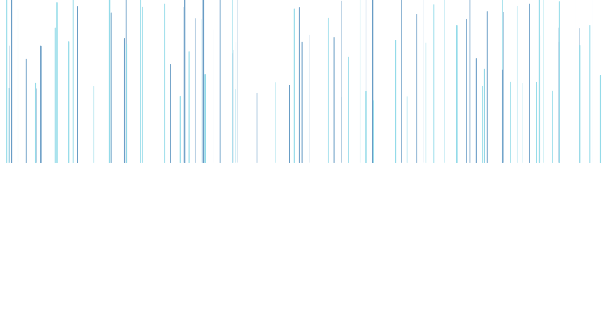

<h1 align="center">Hello, I'm Sharu! :wave:</h1>

  

    
    <!--  -->
    <!--  -->
    
  

   
  
   

  <!--  -->
  <!-- 
   -->

  <table>
    <tr>
      <td>
        
      </td>
      <td>
        
      </td>
    </tr>
  </table>

  

  <!--  -->

